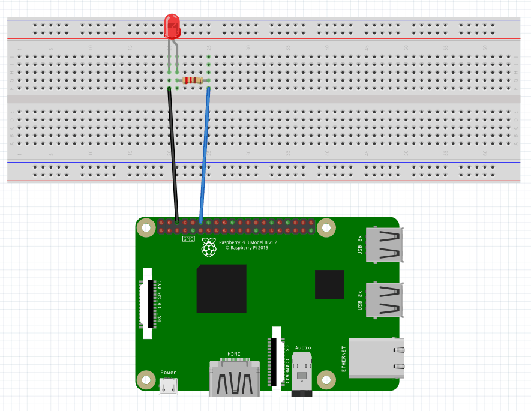

## Breathing Light LED on Raspberry Pi using Python & C

In this Tutorial, we will make a light LED "breathing" using Python & C. The light intensity will start from zero and gradually will increase up to maximum and then will decrease back to zero. To do this will use PWM signals. The PWM signal is a square-wave signal to control the amount of power going to the GPIO pin, in our case to the LED.

### Components:

- DHT11 Temperature and Humidity Sensor(4-pin)
- Raspberry Pi
- 10K Ohm pull up resistor
- LED
- Breadboard
- 2 Jumper wires
- Software: RPI.GPIO(for python), WiringPi(for C)

### Wiring 
 

### Programming in Python

We are using RPI.GPIO module. Raspberry-gpio-python or RPi. GPIO, is a Python module to control the GPIO interface on the Raspberry Pi.

 - In the Raspberry Pi console, build and save the following python code using nano 
`sudo nano breathingled.py`

```
#!/usr/bin/env python
import RPi.GPIO as GPIO
import time

LedPin = 12

GPIO.setmode(GPIO.BOARD)       # Numbers pins by physical location
GPIO.setup(LedPin, GPIO.OUT)   # Set pin mode as output
GPIO.output(LedPin, GPIO.LOW)  # Set pin to low(0V)

p = GPIO.PWM(LedPin, 1000)     # set Frequece to 1KHz
p.start(0)                     # Start PWM output, Duty Cycle = 0

try:
        while True:
                for dc in range(0, 101, 5):   # Increase duty cycle: 0~100
                        p.ChangeDutyCycle(dc)     # Change duty cycle
                        time.sleep(0.05)
                time.sleep(1)
                for dc in range(100, -1, -5): # Decrease duty cycle: 100~0
                        p.ChangeDutyCycle(dc)
                        time.sleep(0.05)
                time.sleep(1)
except KeyboardInterrupt:
        p.stop()
        GPIO.output(LedPin, GPIO.HIGH)    # turn off all leds
        GPIO.cleanup()
```       
- Run the python code using
`sudo python3 breathingled.py`

[](https://youtu.be/fWEfsainrvA)

**Note:** You can increase the breathing time by changing the `time.sleep(0.05)` to `time.sleep(0.10)` i.e., from 5 seconds to 10 seconds or your desired time 

### Programming in C

In C programming, we are including WiringPi module. WiringPi is a PIN based GPIO access library written in C for the BCM2835, BCM2836 and BCM2837 SoC devices used in all Raspberry Pi.

In the Raspberry Pi console, build and save the following C code using nano 
`sudo nano led.c`
```
#include <wiringPi.h>
#include <stdio.h>

#define LedPin    1

int main(void)
{
	int i;

	if(wiringPiSetup() < 0) { //when initialize wiringPi failed, print message to screen
		printf("setup wiringPi failed !\n");
		return -1;
	}

	pinMode(LedPin, PWM_OUTPUT); //pwm output mode

	while(1) {
		for(i=0;i<1024;i++) {
			pwmWrite(LedPin, i);
			delay(1);
		}
		delay(1000);
		for(i=1023;i>=0;i--) {
			pwmWrite(LedPin, i);
			delay(1);
		}
	}

	return 0;
}
```


