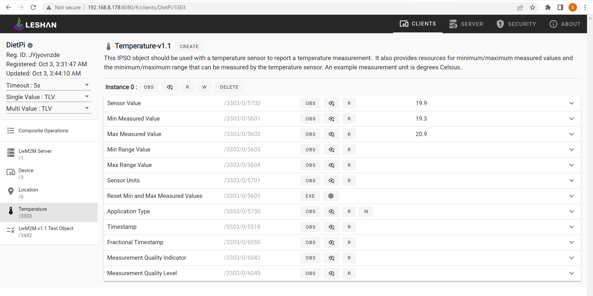

## Reading CPU temperature of Raspberry PI(Dietpi Client) in Leshan server

The system on a chip (SoC) of the Raspberry Pi has a temperature sensor that can be used to measure its CPU temperature.

Officially the Raspberry Pi’s processor is built to withstand temperatures from -40°C to 85°C. As the Raspberry Pi’s temperature gets closer to its upper limit, the system will automatically begin to throttle the processor to try and help the board cool back down.

## Steps:
1. Login to Raspberry Pi thru SSH
2. Start the Leshan server using
  ```
  cd ~/projects/leshan
  java -jar leshan-server-demo/target/leshan-server-demo-*-SNAPSHOT-jar-with-dependencies.jar &
  ```
3. Connect on Leshan demo UI: http://RPI_IPADDR:8080

4. run the leshan client to add it to the page
  ```
  java -jar leshan-client-demo/target/leshan-client-demo-*-SNAPSHOT-jar-with-dependencies.jar
  ```
5. Go to the temperature object(3303) click on 'R' of Sensor value attribute to read the CPU temperature of the Raspberry Pi

 
