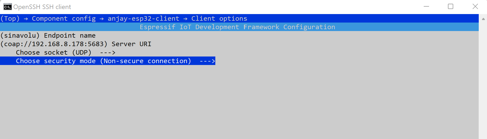

## ESP32 Anjay leshan client experiments - Light control

In this Tutorial, we will see how we can create the Light control object in Leshan Server to control the LED thru Anjay libraries. Light control Object is used to control a light source, such as a LED or other light. It allows a light to be turned on or off and its dimmer setting to be control as a % between 0 and 100.

### Components:

- LED
- Raspberry Pi
- ESP32
- 1 10 K Ohm pull up resistor
- Breadboard
- 2 Jumper wires

### Wiring 

 

### Steps to build/configure Anjay client:

Assuming that anjay-esp32-client directory is setup and your ESP32 is registered in leshan server. 

1. Move to the anjay-esp32-client directory and setup the local enironment for using the esp tools
```
cd ~/projects/Anjay-esp32-client
. $HOME/esp/esp-idf/export.sh
idf.py set-target esp32 
```
2. Setup the device requirements
     ```
     cd ~/projects/Anjay-esp32-client
     idf.py menuconfig
     ```
     - navigate to **Component Config**
     - select **anjay-esp32-client**
     - navigate to **Board options** and enable the light control
     - navigate to **light control options** setup as below      
          
     - navigate to **Client options** and setup as below    
     	 
     -  navigate to **Connection configuration**
         - enter your IOT ROUTER WIFI SSID and key to allow the esp32 acccess to your router and PI.
     - After all the changes are set, press 'S' to save and 'Q' to quit the menuconfig 
3. Build the code for the push button using
    
    ```
     idf.py build
     ```
4. Find the port by using

   ```
   ls -l /dev/ttyUSB*
   ```

5. Flash the device  
     ```
     sudo chmod 666 /dev/ttyUSB0
     idf.py -p 0 flash
     ```
     You should see flashing

6. Start the server using
```
cd ~/projects/leshan
java -jar leshan-server-demo/target/leshan-server-demo-*-SNAPSHOT-jar-with-dependencies.jar &
```

7. Connect on Leshan demo UI: http://RPI_IPADDR:8080

Now you can see the Light control button object enabled in your ESP32 client in leshan server. 

 

You can control the LED as below
- In On/Off, Click on W 
     - enter true to switch on LED 
     - enter false to switch off LED
- In Dimmer, Click on W and give the desired integer value to dim the LED

Check out the below video to see how LED can be controlled by Light control  object of leshan server.

[](https://youtube.com/shorts/SgoDSYvATAs)


 
