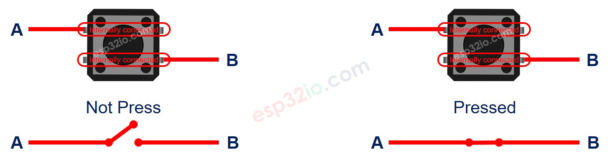
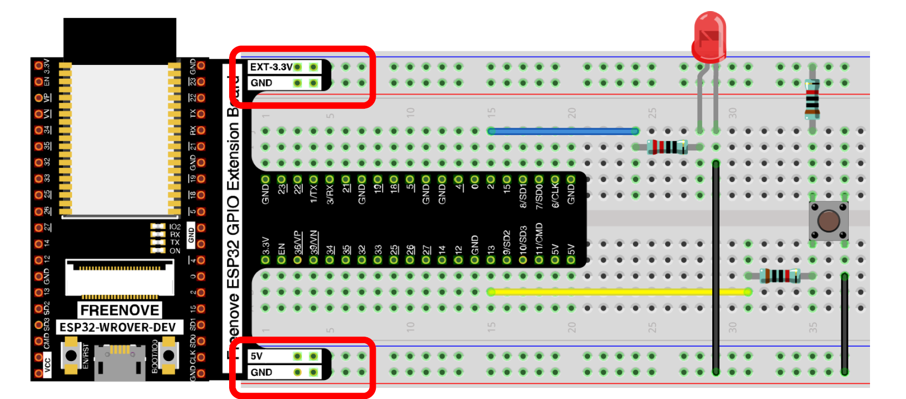
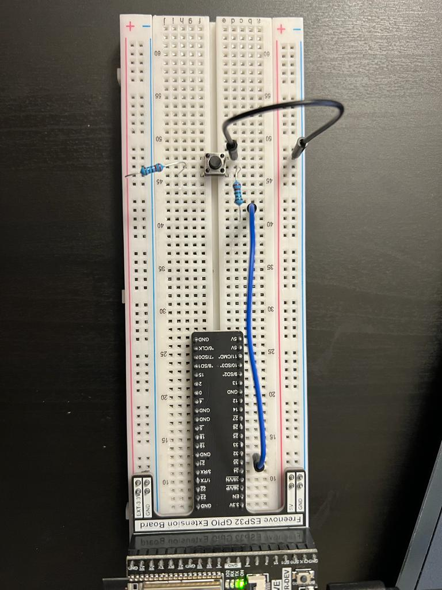
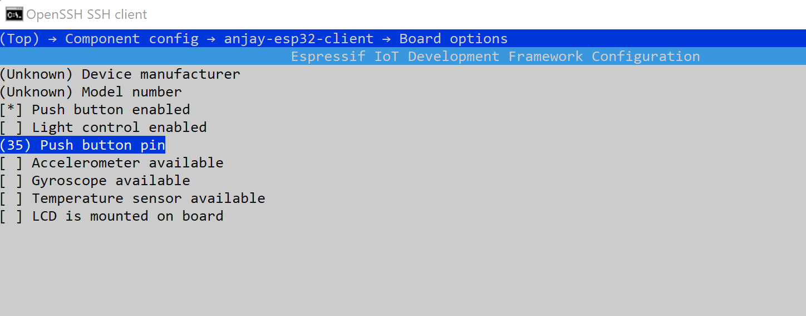
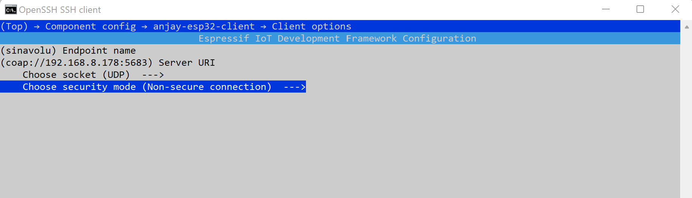
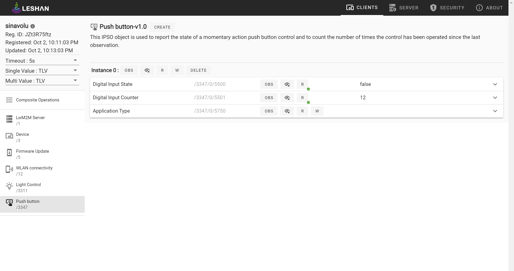

## ESP32 Anjay leshan client experiments - Push Button control

In this Tutorial, we will see how we can create the Push button object in Leshan Server thru Anjay libraries. The button is a basic component and widely used in many ESP32 projects. Push button object is used to report the state of a momentary action push button control and to count the number of times the control has been operated since the last observation.

**How Button Works**
- When the button is pressed, the pin A is connected to the pin B
- When the button is NOT pressed, the pin A is NOT connected to the pin B

 

### Components:

- Push Button
- Raspberry Pi
- ESP32
- 2 220 Ohm pull up resistor
- Breadboard
- 2 Jumper wires

### Wiring 

 
 

### Steps to build/configure Anjay client:

Assuming that Anjay library is build and installed in your PI. [Build_Anjay_Library](https://github.com/saisusmithainavolu/VU_FALL22_IOT_SI/blob/main/ESP32_Anjay_leshan_client_Tutorial/build_Anjay_library.md)

1. move to the anjay-esp32-client directory and setup the local enironment for using the esp tools
```
cd ~/projects/Anjay-esp32-client
. $HOME/esp/esp-idf/export.sh
idf.py set-target esp32 
```

2. Setup the device requirements
     ```
     cd ~/projects/Anjay-esp32-client
     idf.py menuconfig
     ```
     - navigate to **Component Config**
     - select **anjay-esp32-client**
     - navigate to **Board** and setup as below      
          
     - navigate to **Client options** and setup as below    
     	 
     -  navigate to **Connection configuration**
         - enter your IOT ROUTER WIFI SSID and key to allow the esp32 acccess to your router and PI.
     - After all the changes are set, press 'S' to save and 'Q' to quit the menuconfig 
    
3. Build the code for the push button using
    
    ```
     idf.py build
     ```
4. Find the port by using

   ```
   ls -l /dev/ttyUSB*
   ```

5. Flash the device  
     ```
     sudo chmod 666 /dev/ttyUSB0
     idf.py -p 0 flash
     ```
     You should see flashing
     
6. Start the server using
```
cd ~/projects/leshan
java -jar leshan-server-demo/target/leshan-server-demo-*-SNAPSHOT-jar-with-dependencies.jar &
```

7. Connect on Leshan demo UI: http://RPI_IPADDR:8080
 
Now you can see the push button object enabled in your ESP32 client in leshan server. You can read the digital input state(False if LED is not turned on and vice versa) and digital input counter(No.of times the button pushed) of the push button. 

 

 
