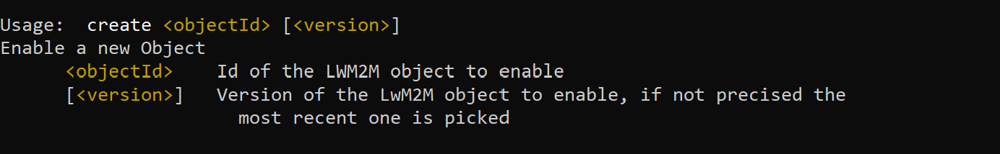
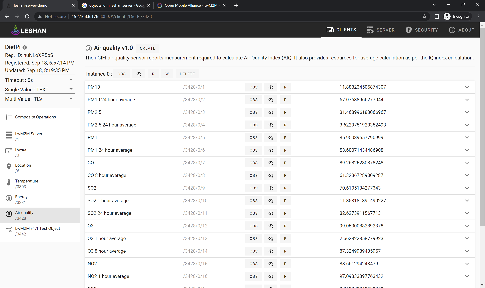
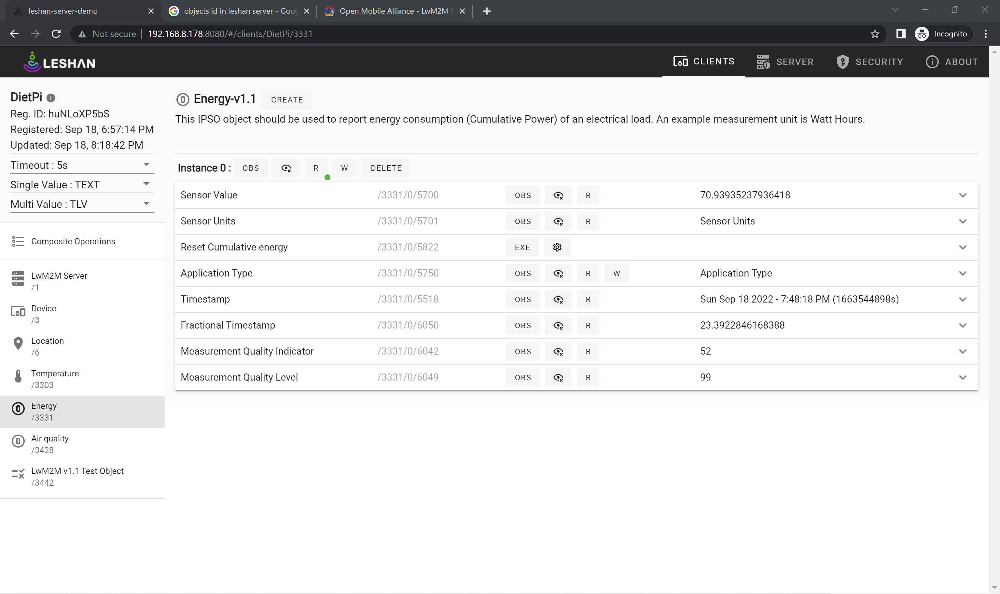
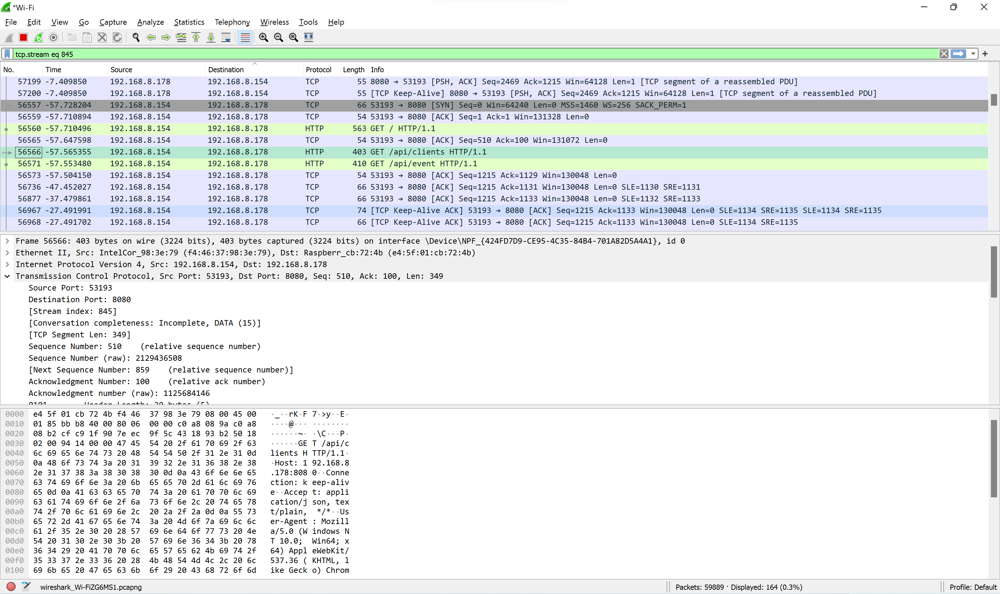
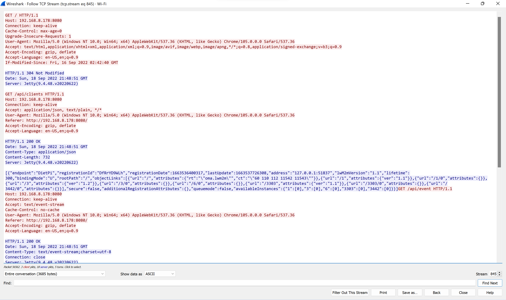

## Experiment 1:
### Create LWM2M Objects in your registered client in the Leshan server

**What is LWM2M Object?**

LWM2M objects are functionalities the LWM2M client provides. An Object is a named collection of individual resource definitions which is mapped directly to a device or to a software component for the purpose of data sharing. A Resource is read, written or executed. Resources within Objects are accessed with simple URIs:/{Object ID}/{Object Instance}/{Resource ID}.

After you register the client to leshan page, you can create objects from DietPi terminal using below command



Information like Object name,Object Id's and thier description can be found at this link [LWM2M Object and Resource Registry](https://technical.openmobilealliance.org/OMNA/LwM2M/LwM2MRegistry.html)

I created Air Quality Object and Energy object
|Object|Command|
|:-----:|:-----:|
|Air Quality|`create 3428`|
|Energy|`create 3331`|





- When connected to respective software applications/sensors, if you want you can read the resource information by clicking on "R" and write/update the information by clicking on "W"

## Experiment 2:
### Using Wireshark to Analyse protocols

I downloaded Wireshark 3.6.8 from the link [Wireshark Download](https://www.wireshark.org/download.html). If you are a windows user, click on Windows Installer(64-bit) to begin te download.

- Install and open the Wireshark app
- Double Click on Wi-Fi among the list of network connections to capture packets
- Wireshark will start showing you the packets captured in real-time
- Visit http://IPPADDR_OF_PI:8080 in the browser
- Come back to Wireshark to see packets being captured of your client page of leshan server



- You can stop capturing packetsusing the icon with a red square on it.  It should be the second one from the left.  
- You can apply filter based on protocols by giving protocol name(such as HTTP or TCP) in the display filter and click the blue arrow
- Select the first HTTP message shown in the packet-listing window.  This should be the HTTP GET message that was sent from your computer to http://IPPADDR_OF_PI:8080
- When you select the HTTP GET message, the Ethernet frame, IP datagram, TCP segment, and HTTP message header information will be displayed in the packet-header window
- Right click on this packet and navigate to Analyze --> Follow --> TCP Stream. You will be able to see the full http data



- Data sent using any protocol without encryption can be captured and analyzed the same way to obtain some interesting details.
- I am able to see all my LWM2M objects id's displayed in the TCP Stream
- You can save the Wireshark packet capture results (File > Save As).  
- Exit Wireshark

## Experiment 3:
### Running bootstrap demo server

- In the downloads directory in the raspberry Pi, get the jar file(if not present already)
```
wget https://ci.eclipse.org/leshan/job/leshan/lastSuccessfulBuild/artifact/leshan-bsserver-demo.jar
```
- Run the leshan bootstrap server 
``` 
java -jar leshan-bsserver-demo/target/leshan-bsserver-demo-*-SNAPSHOT-jar-with-dependencies.jar
```

**Configure the lwm2m-client sample in the Demo Bootstrap Server:**

- Click on “Add new client bootstrap configuration”

- Enter the following data:

