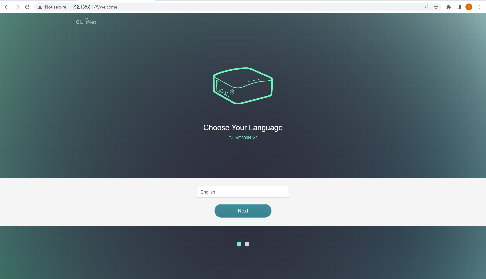
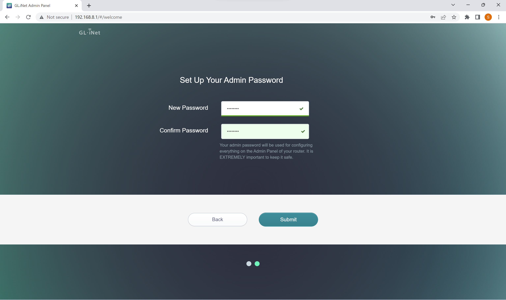
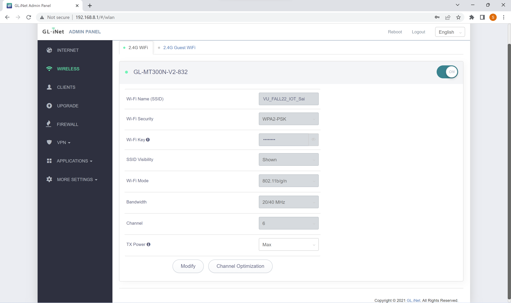
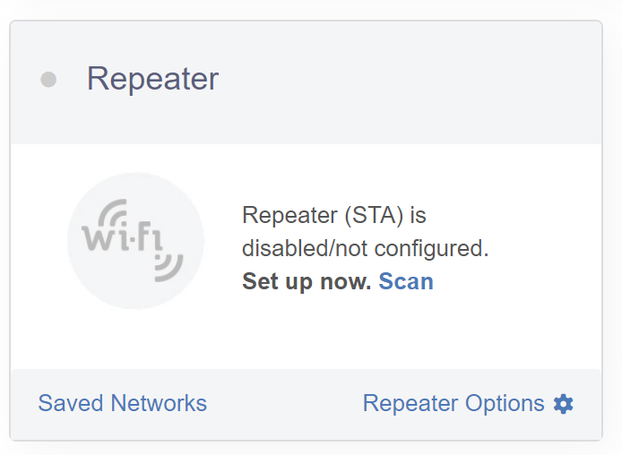
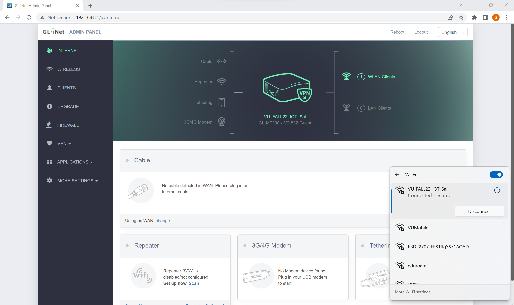

# IOT_FALL22_VU
## You are just 3 -step away from setting up the mini router!!
### Let's get started..

>**Step 1 : Power On**

  Plug the Micro USB power cable into the power port of the router

>**Step 2 : Connect**

  You can connect to the router via Ethernet cable or Wi-Fi.

|**Connect via LAN**                 | **Connect via Wi-Fi**  | 
| :--------------------------------------------:| :-----------------:  | 
| Connect your device to the LAN port of the router via Ethernet cable.| Search for the SSID of the router in your device and input the default password: goodlife.|
| **Note:** This step only connects your devices to the local area network (LAN) of the router. You cannot access the Internet currently.  | **Note:** The SSID was printed on the bottom label of the router with the following formats: `GL-MT300N-XXX` or `GL-MT300N-V2-XXX`

>**Step 3 : Setup Router**

Open a web browser and visit http://192.168.8.1. You will be directed to the initial setup of the web Admin Panel.
                                                                          
- Language Setting 

You need to choose the display language of the Admin Panel. Available languages are English, 简体中文, 繁體中文, Deutsch, Français, Español, Italiano 日本語, 한국어 and Русский.

- Setup Admin password

There is no default password for this Admin Panel. You have to set your own password, which must be at least 5 characters. Then, click Submit to proceed.

- Change the SSID

After the initial setup, you will enter the web Admin Panel of the router. Go to the **Wireless** tab in the left menu click **Modify** and change the SSID and password for your wireless connection.

- Configure Repeater

Repeater connects the router to another existing wireless networks. Go to Repeater section, click **Scan**. It searches for available wireless networks nearby. Choose a SSID from the drop-down list and enter its credentials. You can also enable the **Remember** button to save the current chosen wireless network. Finally, click **Join**.

Choose the updated SSID from the available Wifi and connect to it. You will be now connected to the Wi-Fi with internet.

# Important:
Make sure you are using a standard 5V/1A power adapter. Otherwise it may cause malfunction.

Changing the password in the web admin panel will not change your Wi-Fi password.